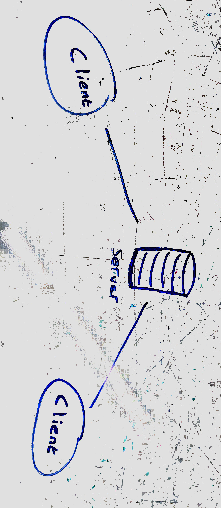

# TCP Server
## Lab17

### Author: Alistair Blake

## Learning Objectives:  
* Networks computers by implementing a TCP server
* Describes computer networking using the OSI model
* Describes computer networking using the Internet Protocol Suite

## CS Concept:
TCP Packets

## To Run the app:
* command line interface 1: `node server.js`
* command line interface 2: `node app.js filepathfolder/filepath.txt`
* command line interface 3: `node logger.js`

## UML

